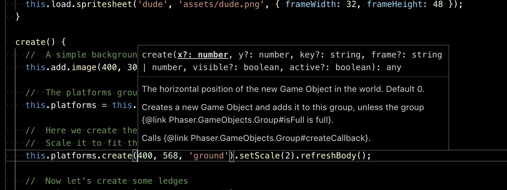
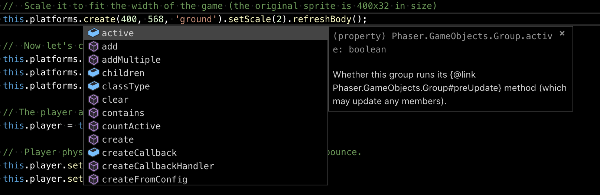

# Phaser tutorial

This is the Phaser tutorial, but laid out using a separate JavaScript file for the game (`game.js`) and using a JavaScript class.

The `jsconfig.json` file enables autocomplete for Visual Studio Code, which then scans for TypeScript definitions. The `defs/phaser.d.ts` file is then discovered by Visual Studio Code. Over in `game.js` the header `/* global Phaser */` then completes the autocomplete journey.

## Showing function parameters

## Listing methods

